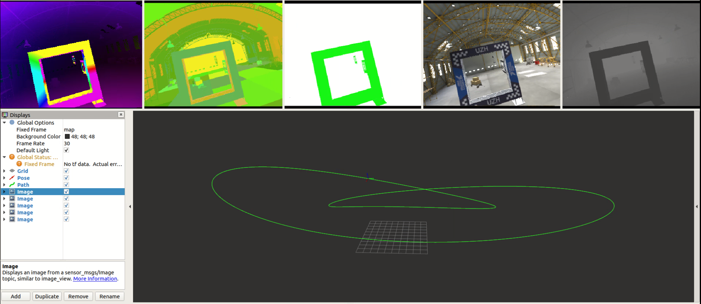

# rpg_flightmare
A quadrotor simulator that simulates rotor dynamic and quadrotor dynamics.

 It simulates UAV dynamics and supports high-quality image renderering, and hardware in-the-loop control. Our goal is to make RPG Flightmare as a research platform for developing vision-based Micro Aerial Vehicles (MAVs) using optimal control strategies or reinforcement learning algorithms, we focus on enabling autonomous flight using vision and IMU as main sensor modalities.

Instead of having an all-in-one simulator like AirSim, rpg_flightmare offers 
huge modularity with its [ROS](https://www.ros.org/) based structure. New ROS 
packages can quickly be added and all ROS messages (e.g. pose, trajectory, image, post-processing images (depth, segmentation, optical-flow)) can be recorded and visualized with RVIZ. [ZMQ](https://zeromq.org/) messages add the possibility of 
using [Unity](https://unity.com/) as renderer and therefore photo-realistic 
simulations can be generated.



# Usage

Follow the [Usage guide](https://github.com/uzh-rpg/rpg_flightmare/wiki/Usage-Guide)
to run an example launch file.


Here a simple example of how to spawn a drone in the simulator.

```cpp

// rpqg simulator
#include <rpgq_simulator/simulator.h>
#include <rpgq_simulator/implementation/objects/quadrotor_vehicle/quad_and_rgb_camera.h>

#define CONTROL_UPDATE_RATE 50.0

using namespace RPGQ;

int main(int argc, char * argv[]) {
  // initialize ROS
  ros::init(argc, argv, "flightmare_example");
  ros::NodeHandle nh("");
  ros::NodeHandle pnh("~");

  // define the scene id
  FlightmareTypes::SceneID scene_id = FlightmareTypes::SCENE_WAREHOUSE;

  // quad ID can be any real number between
  // 0 ~ 25, each ID corresponding to a unique
  // quad name
  QuadrotorID quadID = 1;
  std::string quadName = QuadrotorName(quadID);

  // create simulator
  std::shared_ptr<Simulator::Simulator> sim = std::make_shared<Simulator::Simulator>();
  // enable flightmare for visualization
  sim->SetFlightmare(true);

  // create a quadrotor with a RGB Camera on it.
  std::shared_ptr<Simulator::QuadrotorVehicle> quad =
    std::make_shared<Simulator::QuadrotorVehicle>(quadName, nullptr, 1000000);
  Eigen::Vector3d init_pose{0.0, 0.0, 3.0};
  quad->SetPos(init_pose);
  quad->SetQuat(Eigen::Quaterniond(std::cos(0.5*M_PI_2),0.0,0.0,std::sin(0.5*M_PI_2)));
  quad->SetSize(Eigen::Vector3d(0.3, 0.3, 0.3));

  // add quad to simulated optitrack for
  // pose estimation of the quadrotor
  sim->AddObjectToOptitrack(quad);

  // add quadrotor to Unity standalone
  // for visulization
  sim->AddObjectToUnity(quad);

  // set up multi-purpose timer
  std::shared_ptr<ExtTimer> timer;
  timer.reset(new ExtTimer(sim->GetSimTimer()));

  // main loop
  Timer loopTimer;

  while (ros::ok())
  {
    // enable visualization and add objects
    if (!sim->FlightmareIsReady()){
      sim->ConnectFlightmare(scene_id);
    }
    // start measuring time
    loopTimer.Reset();

    // run ros callbacks
    ros::spinOnce();

    // 2 seconds startup time for the simulation
    if (sim->ElapsedSeconds() > 2.0)
    {
        // here could be your controller, pose estimator, ...
    }

    // run simulation
    sim->Run(1.0/CONTROL_UPDATE_RATE);

    // stop measuring time, sleep accordingly
    double secsToSleep = 1.0/CONTROL_UPDATE_RATE - loopTimer.ElapsedSeconds();
    if (secsToSleep > 0.0)
    {
      usleep(secsToSleep*1e6);
    }
  }
  return 0;
}

```
# Installation

Follow the [Installation guide](https://github.com/uzh-rpg/rpg_flightmare/wiki/Installation-Guide) to setup rpg_flightmare simulator.

# Developement

Clone [rpg_flightmare_unity](https://github.com/uzh-rpg/rpg_flightmare_unity/) 
for developement. New scenes and objects can be added to the unity project 
without further changes in rpg_flightmare.  

